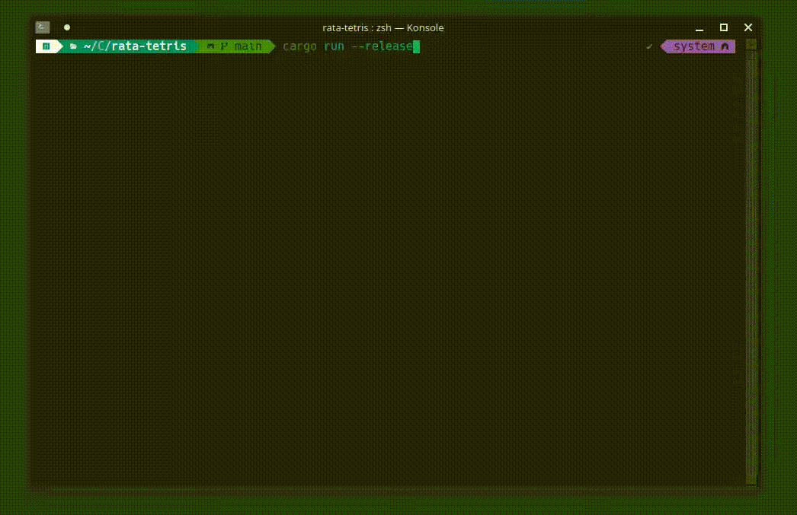

# rata-tetris

***Things I want to include***
- A terminal rendition on the user interface. This is meant to be played in the terminal so it won't be _exactly_ like the classic Tetris.
- Recreation of the rules, rotation behavior, game speed, score, and anything else.
- Addition of the instant drop mechanic from more modern Tetris clones.
- Addition of the ghost outline for pieces drop location.
